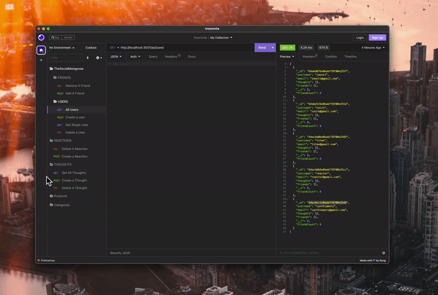

# The Social Mongoose
An API for a social network web application where users can share their thoughts, react to friends’ thoughts, and create a friend list.

## Table of Contents

- [Description](#description)
- [User Story](#user-story)
- [Acceptance Criteria](#acceptance-criteria)
- [Preview GIF](#preview-gif) 
- [Link To Walkthru Video](#link-to-walkthru-video)
- [Installation and Usage](#installation-and-usage)
- [Available Endpoints](#available-endpoints)
- [Tests](#tests)
- [Technologies Used](#technologies-used)
- [Credits](#credits)
- [License](#license)

## Descriptiom

This application serves as the foundation for a full-stack social network application. It utilizes a MongoDB database, Express.js routing, and the Mongoose ODM. The primary purpose is to establish the initial CRUD API routes for the application, enabling users to perform operations such as creation, searching, updating, and deletion. Additionally, users can engage in various activities, including sharing their thoughts, reacting to friends' thoughts, creating friend lists, and managing their own content. While the application is still in its early stages, the integration of MongoDB database and API middleware routing represents a crucial initial step in exploring the potential of MongoDB and the Mongoose ODM.

## User Story

```md
AS A social media startup
I WANT an API for my social network that uses a NoSQL database
SO THAT my website can handle large amounts of unstructured data
```

## Acceptance Criteria

```md
GIVEN a social network API
WHEN I enter the command to invoke the application
THEN my server is started and the Mongoose models are synced to the MongoDB database
WHEN I open API GET routes in Insomnia for users and thoughts
THEN the data for each of these routes is displayed in a formatted JSON
WHEN I test API POST, PUT, and DELETE routes in Insomnia
THEN I am able to successfully create, update, and delete users and thoughts in my database
WHEN I test API POST and DELETE routes in Insomnia
THEN I am able to successfully create and delete reactions to thoughts and add and remove friends to a user’s friend list
```

## Preview GIF
- ## Preview - Insomnia Test Functionality


## Link To Walkthru Video
**Walkthrough Video:** [Link To Walkthru Video](Youtube link here) 


## Installation and Usage
- To clone the repo: https://github.com/cynthiamory/TheSocialMongoose.git
- Install [Node](https://nodejs.org/en). version 16 and up. Command line: 
```bash
npm init
```
- Install Dependencies
```bash
npm install
```
- Run the application to initiate the server using Command: 
```bash
npm run start
```
- Now you can leverage Insomnia to test the application's local server: http://localhost:3001. It provides a set of API routes, including GET, POST, PUT, and DELETE, for users, thoughts, and reactions. These routes are designed to facilitate seamless operations such as creating, updating, and deleting data in the database.

## Available Endpoints
```md
1. GET /api/users - get ALL users
2. GET /api/users/:userId - get SINGLE user by ID
3. POST /api/users - create a user
4. PUT /api/users/:userId - update a user by ID
5. DELETE /api/users/:userId - delete a user by ID
6. GET /api/thought - get all thought
7. GET /api/thought/:thoughtId - get a single thought by ID
8. POST /api/thought - create a new thought
9. PUT /api/thought/:thoughtId - update a thought by ID
10. DELETE /api/thought/:thoughtId - delete a thought by ID
11. POST /api/thought/:thoughtId/reactions - add a reaction to a thought
12. DELETE /api/thought/:thoughtId/reactions/:reactionId - Delete a reaction from a thought
13. POST /api/users/:userId/friends/:friendId - add a friend to a user's friend list
14. DELETE /api/users/:userId/friends/:friendId - remove a friend from a user's friend list
```

## Tests
- There are no tests yet for this application

## Technologies Used
Assignment was built with:


## Credits
- TheSocialMongoose: Cynthia Morales - Full Stack Developer Student.
- Institution: The University Of Toronto
- Course: Bootcamp Full Stack Development
- Instructor: Ali Masqood 
- Sub Instructor: Edward J. Apostol
- Tutor: Jose Lopez 
- Learing Assistant Ask BCS Support: Conner Hollis aka chollis on Slack
- Online Support: W3Schools, Youtube, SQL Shack, mySQL, Stack Overflow, Sequelize.org
- License badges: Sheilds.io


## License

